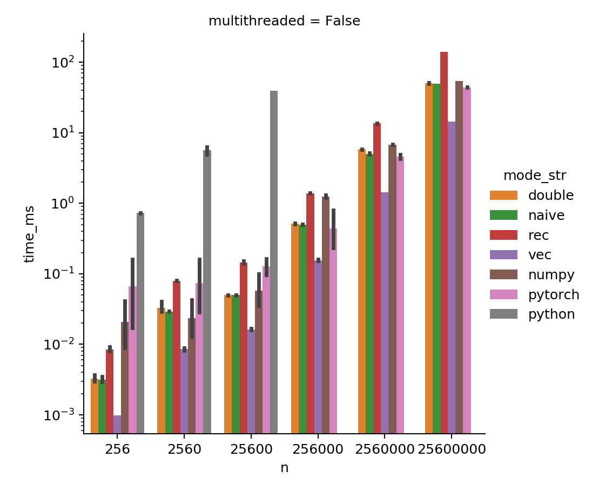
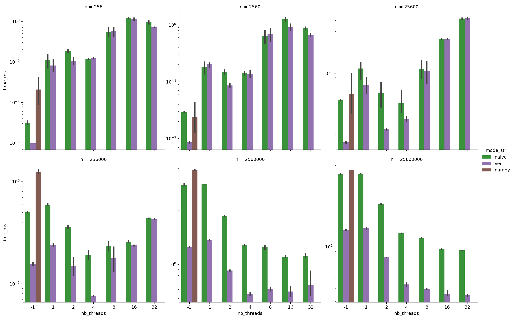
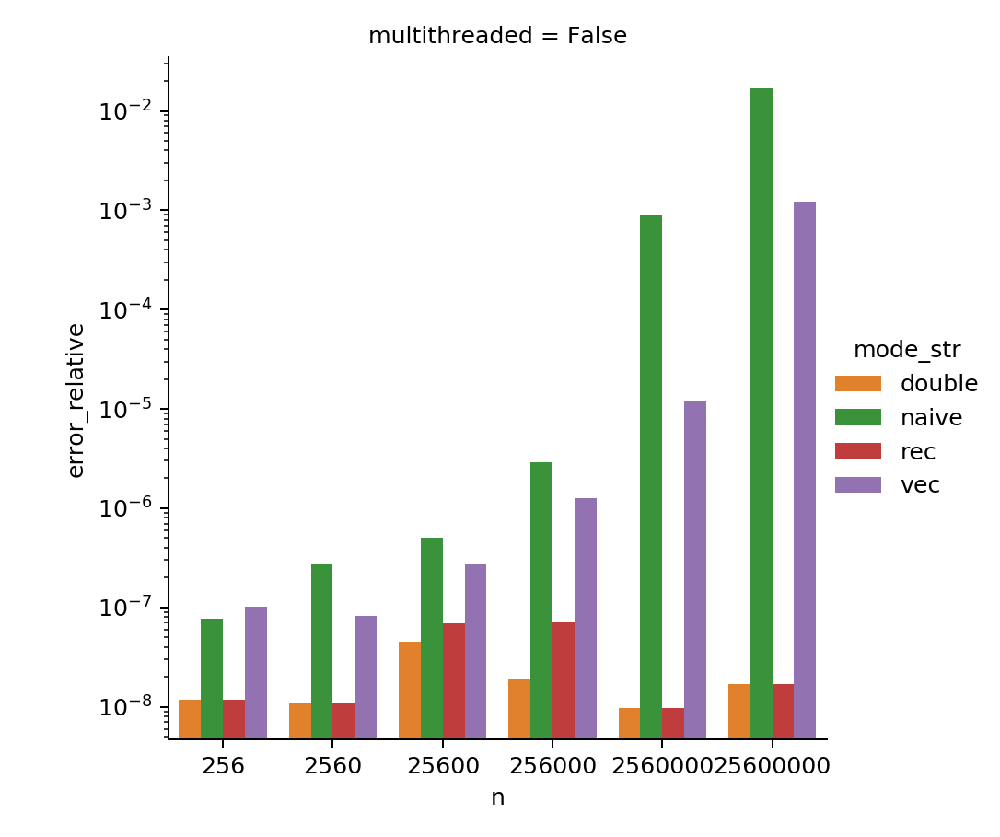

14/12/2020 - Alexandre Thomas & Matthias Crémieux

# HPC project - S1825

The objective of this project is to compute following function :

$$
d(U) = \sum_{i=0}^{n-1} \sqrt{|u_i|}
$$

With $U$ a vector of random numbers s.t. $|u_i| < 1$.

We implemented several approaches in C:
- **naive** : naive `for` loop, using only floats
- **double** : same logic than *naive*, but using a double variable for the sum. This approach allows much better precision
- **rec** : a recursive approach we tried, to get a precise sum using only floats. This significantly improved the precision compared to *naive*, but is slower to compute. Another equivalent but faster function (similar to *naive*) could also have been implemented with a bottom-up logic.
- **vec** : a vectorized version of *naive*, using AVX and `__m256` variables

We also implemented the same norm function in python, for comparison:
- **python** : equivalent of the naive `for` loop, but in pure python
- **numpy** : computing the result using the widely used `numpy` numerical computing library, with a number of operations actually implemented in C
- **pytorch** : idem, with the machine learning framework `pytorch`

We ran a couple experiments on Debian machines with the following specs :
```
Architecture:        x86_64
CPU op-mode(s):      32-bit, 64-bit
Byte Order:          Little Endian
Address sizes:       39 bits physical, 48 bits virtual
CPU(s):              12
On-line CPU(s) list: 0-11
Thread(s) per core:  2
Core(s) per socket:  6
Socket(s):           1
NUMA node(s):        1
Vendor ID:           GenuineIntel
CPU family:          6
Model:               158
Model name:          Intel(R) Core(TM) i7-8700K CPU @ 3.70GHz
Stepping:            10
CPU MHz:             800.567
CPU max MHz:         4700.0000
CPU min MHz:         800.0000
BogoMIPS:            7392.00
Virtualization:      VT-x
L1d cache:           32K
L1i cache:           32K
L2 cache:            256K
L3 cache:            12288K
NUMA node0 CPU(s):   0-11
```

Our program was compiled **without optimization flags**, using gcc 8.3.0 and the following command: `gcc -o project project.c -mavx -lpthread -lm -Wall`

## Without multithreading
We run a couple experiments to compare the various implementations, with different values for `n`, the size of the vector.

We can observe on the figure below that:
- The  and *double* versions consistently take the same amount of time. This actually makes sense as we are using a x86 architecture which implements doubles and emulates float, the float operations should not be faster [^1]. (The precision and correctness of the result does change drastically for large `n` though)
- The vectorized version *vec* is significantly faster than the *naive* version (3.3 times faster without multithreading). As a single `__m256` operation operates on 8 floats at the same time, we could have expected up to a 8x speedup, but this seems to be due to the `sqrt` function that `_mm256_sqrt_ps` uses. When using the more precise `sqrt` function in the *naive* approach as well (instead of `sqrtf`), the *naive* approach was actually almost exactly 8x longer to execute.
- Interestingly, the *numpy* and *pytorch* approaches are orders of magnitude faster than the naive *python* approach, but are not faster than the *naive* C approach (without even setting optimization flags).




Relative speedup, compared to the *naive* approach ( `nb_threads = -1` means no multithreading):


    mode  		nb_threads		speedup
    numpy     -1            0.871745
    vec       -1            3.299917
               1            2.161675
               2            2.513281
               4            1.971108
               8            1.634851
               16           1.559915
               32           1.553804

[^1]:  https://github.com/lefticus/cppbestpractices/issues/46 ↩

## Using `pthread` to parallelize the computations

We also ran experiments with various values for `nb_threads` :
- with `nb_threads = -1`, there is no threads, just like before
- for `nb_threads > 0`, we parallelize the computation using this number of threads

We observe that creating and using the threads adds an overhead that can be quite significant when `n` is small (an order of magnitude or more). However, as expected, multi-threading does speed up the program for larger values of `n`.



## Remarks on the precision

In order to get a better insight on the numerical error, we compared our results with the results of an *oracle* function working and returning double precision. The figure below shows the mean relative error (across trials), compared to the *oracle*.

As could be expected, when using float variables to store the sum of our computations so far (like in the **naive** and **vec** approaches), the error grows when `n` gets larger. When `n` gets large, the `sum` variable gets large as well at some point, in which case we lose more and more precision when adding small numbers (recall that $|u_i| < 1$). For very large values of `n` (not shown here), there is even a point where adding $u_i$ to the `sum` variable does nothing at all, which leads to completely incorrect results.

This issue can be prevented using double variables to store the sum (like in the **double** approach), in which case we don't lose precision when adding the $u_i$. This could also be implemented in a vectorized way, using `__m256d` variables that store 4 doubles instead of 8 floats. However, in this case switching to double precision would probably slow down the computations, as twice less operations would be done at the same time.

Finally, our recursive approach **rec** using only float variables does fix the precision issue, and is similar to the **double** approach. Instead of summing the small $u_i$ to a single `sum` variable that keeps getting larger, the recursive approach sums the $u_i$ between them progressively in order to always add numbers of the same order of magnitude.



## References

- http://www.hemisphere-education.net/cours/s1825/, S1825 class material, C. Tadonki
- https://software.intel.com/sites/landingpage/IntrinsicsGuide/, Intel intrisics documentation
- https://www.codeproject.com/Articles/874396/Crunching-Numbers-with-AVX-and-AVX, Crunching Numbers with AVX and AVX2, M. Scarpino

- https://www.agner.org/optimize/optimizing_cpp.pdf, Optimizing software in C++, A. Fog